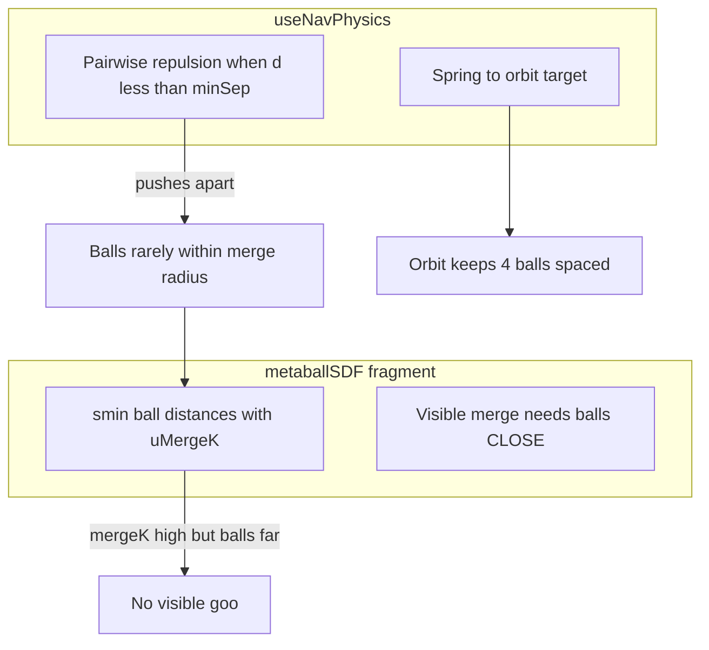
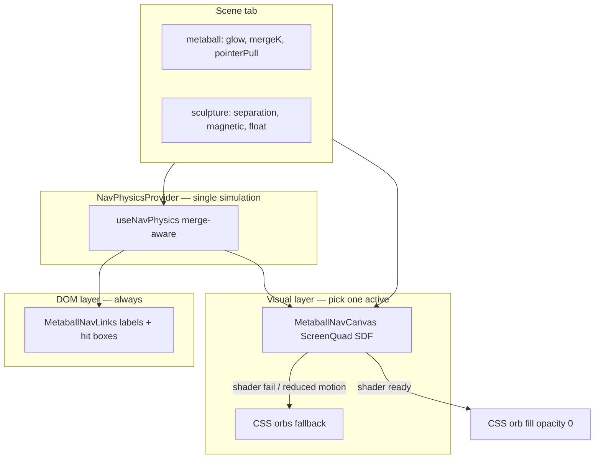

# Metaball nav: merge + animated color — full implementation plan

**Status:** Plan only (for next agent session)  
**Last updated:** 2026-06-06  
**Audience:** Implementation agent (attach this file + read linked handoffs)  
**Prerequisite reading:** `docs/scene3d-nav-agent-handoff.md`, `05-Logs/Daily/2026-06-06-cursor-notes.md`

---

## 1. Goal (user-facing)

Landing nav should feel like **living metaballs**:

1. **Merge** — when orbit brings two bubbles close, they **goo together** (smooth-min SDF blend), like the lab shader did at one point.
2. **Color** — orb colors **drift / pulse / shimmer** subtly (not static flat gradients).
3. **Labels** — stay **upright, readable** (Meltdown MF, ~94% orb width, stroke + shadow, **no backdrop pills**).
4. **Interaction** — DOM hit targets + warp nav + long-press phone unlock must keep working.

**Non-goals for this pass:** R3F `Html` labels on meshes, arc/spin labels, semi-transparent label pills, re-enabling legacy `#navOrbit` DOM bubbles.

---

## 2. Current baseline (do not regress)

| Area | Shipped state |
|------|----------------|
| Nav render | `NavSculptures` → `NavPhysicsProvider` → `MetaballNavLinks` (`flatLabels`) |
| Orbs | CSS radial gradients per `--nav-ball-color` in `arrival.css` |
| WebGL | `MetaballNavCanvas` **lab only** (`/fx/metaball-lab/`) |
| Physics | `useNavPhysics.ts` — spring to orbit targets + **pairwise repulsion** when `d < minSep` |
| Shader | `metaballSDF.ts` — `smin()` merge via `uMergeK`; per-ball colors; Errl cutout |
| Phone | Bottom-right dock, scroll isolation, 5×2 tabs |
| Tests | Playwright removed; manual QA + `npm run portal:visual-test` |

---

## 3. Root cause: why merge “worked in lab” but failed on landing



| Failure mode (2026-06-06 session) | Cause | Rule |
|-----------------------------------|-------|------|
| Labels only, no orbs | Hybrid hid CSS orbs on WebGL `onReady` but shader invisible/misaligned | Never hide CSS fill until shader passes visual gate |
| Muddy double blobs | CSS orbs + WebGL drawn together | **One** visual layer for orbs (shader OR CSS, not both opaque) |
| Edge-on sliver orbs | `rotateY(--orb-spin)` on CSS orbs | Flat billboard only on landing |
| Errl ghost silhouette | Shader fullscreen + bad cutout / dark field behind Errl | Cutout must match `#errl` rect; canvas z-index below Errl labels |
| Legacy nav flash | `#navOrbit` painted before CSS hid it | Keep `boot-shell.js` inline hide for metaball mode |
| Playwright noise | Heavy e2e on Mac | Manual QA at 390 / 768 / 1440 |

**Core fix for merge:** Physics must **allow proximity** (merge-aware separation) while DOM `<a>` hit targets stay usable. Shader draws merged goo; links stay at ball centers.

---

## 4. Target architecture



### Layer responsibilities

| Layer | Role | pointer-events |
|-------|------|----------------|
| `MetaballNavCanvas` | SDF metaballs, merge, animated color in shader | `none` |
| `MetaballNavLinks` | Meltdown labels + `<a>` hit targets at physics positions | `auto` on links only |
| CSS `.errl-metaball-link__orb` | Fallback visual when WebGL off; hidden when shader ready | n/a |

---

## 5. Implementation phases

### Phase 0 — Lab proof (required before landing WebGL)

**Goal:** `/fx/metaball-lab/` shows convincing merge + color motion with Scene sliders live.

| Task | File(s) | Notes |
|------|---------|-------|
| Tune merge visibility | `metaballSDF.ts`, `MetaballNavCanvas.tsx` | `uMergeK = mergeK * scale` — document scale; test 0.2–0.8 mergeK |
| Animated color in shader | `metaballSDF.ts` | Use `uTime` + per-ball phase: hue shift / rim pulse on `baseCol` |
| Improve color at merge boundary | `metaballSDF.ts` | Replace naive `pickColor` with blend by inverse distance or field strength |
| Merge-aware physics (lab) | `useNavPhysics.ts` | See §6 — behind flag or always when metaball mode |
| Lab UI | existing Scene tab sliders | Glow, Merge K, Pointer pull must visibly change lab |

**Exit criteria:** Record 10s screen capture: two balls orbit close → visible goo bridge; Merge K slider obvious; colors breathe.

---

### Phase 1 — Merge-aware physics (shared)

**Goal:** Balls can get close enough for `smin` merge without stacking on top of each other.

**File:** `src/apps/landing/scene/nav/useNavPhysics.ts`

```typescript
// Concept (implement cleanly):
const mergeFactor = clamp(mb.mergeK, 0, 1);
const effectiveMinSep = minSep * lerp(1.0, 0.55, mergeFactor);
// Optional: when d < mergeVisualRadius, reduce repulsion strength further
const repulsionStrength = lerp(1.0, 0.25, mergeFactor);
```

| Task | Detail |
|------|--------|
| Couple separation to `mergeK` | High mergeK → lower `effectiveMinSep` |
| Couple separation to `sculpture.separation` | Keep Scene tab meaningful |
| Expose merge proximity (optional) | Add `mergeT: 0–1` per pair or per ball on `NavPhysicsState` for CSS bridge |
| Never zero separation | Min gap ~0.4× bubble diameter so hit targets don’t overlap confusingly |

**Exit criteria:** With mergeK=0.7, balls visually overlap centers in lab positions; with mergeK=0, they stay distinct.

---

### Phase 2 — Landing hybrid (shader visual + DOM labels)

**Goal:** Restore metaball look on landing **without** double-draw ugliness.

**Files:** `NavSculptures.tsx`, `MetaballNavCanvas.tsx`, `MetaballNavLinks.tsx`, `NavPhysicsContext.tsx`, `arrival.css`

| Step | Action |
|------|--------|
| 2a | `NavHybridStack`: mount `MetaballNavCanvas` + `MetaballNavLinks` under `NavPhysicsProvider` |
| 2b | Canvas: `stepSimulation={false}` — only `MetaballNavLinks` rAF calls `physics.step()` |
| 2c | Canvas: `pointer-events: none`, `z-index: 4` (below labels at 6, above scene layer) |
| 2d | Links: hide CSS orb **opacity** (not `display:none` until ready) when `webglReady && !reducedMotion` |
| 2e | `onReady` gate: first frame with valid ball uniforms + non-zero alpha at sample pixel OR 2 consecutive frames |
| 2f | `prefers-reduced-motion`: skip canvas; full CSS orbs + Phase 3 color animation only |

**CSS orb handoff:**

```css
.errl-metaball-nav--shader-ready .errl-metaball-link__orb {
  opacity: 0;
}
/* Keep hit box size unchanged */
```

**Exit criteria:** No flash of legacy DOM bubbles; no double opaque orbs; labels readable; warp + long-press work.

---

### Phase 3 — Animated color (both paths)

#### Path A — Shader (primary when hybrid on)

**File:** `metaballSDF.ts`

- Per-ball phase offset `(i * 1.7)` in uniform or computed in JS
- Animate: `col *= 1.0 + 0.08 * sin(uTime * 0.9 + phase)`; optional hue rotate via approx in RGB
- `uGlow` modulates rim pulse amplitude (already wired from Scene tab)

#### Path B — CSS fallback (reduced motion + shader fail)

**Files:** `arrival.css`, `MetaballNavLinks.tsx`

- `@keyframes errl-orb-glow-pulse` on box-shadow
- `@property --orb-tint` + keyframes on `color-mix` for base color drift
- Per-link `--orb-phase: ${i * 0.7}` set in rAF or once on mount
- Wire `--nav-orb-glow` / `--nav-orb-merge` from `getMetaball()` subscribe (partially exists)

**Exit criteria:** Scene **Glow** slider changes pulse; orbs never look static at default settings; reduced motion = static.

---

### Phase 4 — Shader color at merge seams

**Problem:** Today `pickColor()` picks nearest ball center — merge neck gets wrong color.

**File:** `metaballSDF.ts`

Replace with field-weighted blend:

```glsl
// Concept: weight_i = exp(-k * ballDist_i) normalized
vec3 baseCol = weightedBlend(uColor0..3, weights);
```

**Exit criteria:** Goo bridge between pink + green reads as blended hue, not hard switch.

---

### Phase 5 — Scene tab + docs

| Task | File |
|------|------|
| Update Scene tab copy | `index.html` Scene section — Merge K affects goo + physics spacing; Glow affects pulse |
| Wire any dead sliders | `scene-phone-controls.ts` — bloom/steps may be lab-only; document which affect landing |
| Update handoff | `docs/scene3d-nav-agent-handoff.md` — architecture diagram §11 |
| Archive superseded | `docs/active/nav-bubble-color-animation.md` → point to this doc |

---

## 6. Physics vs shader parameters

| Control | Storage | Physics effect | Visual effect |
|---------|---------|----------------|---------------|
| `mergeK` | `bundle.scene.metaball` | Lowers repulsion / minSep | `uMergeK` in smin |
| `glow` | metaball | — | Rim brightness + CSS pulse amp |
| `pointerPull` | metaball | Pointer attraction | Shader pointer offset on balls |
| `separation` | sculpture | Base minSep multiplier | Indirect (ball spacing) |
| `magneticRadius` | sculpture | Pointer field size | — |
| `floatSpeed` | sculpture | Orbit wobble rate | Shader `uTime` sync optional |

---

## 7. Files touch map

| File | Phase |
|------|-------|
| `scene/nav/useNavPhysics.ts` | 1 |
| `scene/effects/shaders/metaballSDF.ts` | 0, 3, 4 |
| `scene/effects/MetaballNavCanvas.tsx` | 0, 2 |
| `scene/nav/NavSculptures.tsx` | 2 |
| `scene/nav/MetaballNavLinks.tsx` | 2, 3 |
| `scene/nav/NavPhysicsContext.tsx` | 2 (no change if already provider) |
| `styles/arrival.css` | 2, 3 |
| `scripts/boot-shell.js` | verify only |
| `scripts/dev-phone-unlock.js` | verify only |
| `scripts/scene-phone-controls.ts` | 5 |
| `apps/static/pages/fx/metaball-lab/` | 0 |

---

## 8. Manual QA checklist (final)

Environment: `http://127.0.0.1:5173/?skipIntro=1`

| # | Check |
|---|--------|
| 1 | Four labels: Forum, About, Gallery, Studio — readable, no pills |
| 2 | Orbs merge when orbit brings them close (adjust Merge K in Scene tab) |
| 3 | Colors animate subtly at rest; Glow slider changes intensity |
| 4 | Pointer pull tugs nearby balls (desktop) |
| 5 | Warp to About/Gallery/Studio still works |
| 6 | Long-press Errl ~2s → Customize bubble bottom-right |
| 7 | Phone panel scroll in Dev/Scene tabs |
| 8 | No `#navOrbit` flash on load |
| 9 | `prefers-reduced-motion`: CSS orbs, no WebGL, static color |
| 10 | Viewports: 390, 768, 1440 |

Lab: `/fx/metaball-lab/` — merge + sliders before landing Phase 2.

---

## 9. Agent execution order (recommended)

1. **Phase 0** in lab only — do not touch landing until screen capture OK  
2. **Phase 1** physics — verify in lab + console log min distances  
3. **Phase 4** shader color blend — improves lab merge look  
4. **Phase 3** shader color animation  
5. **Phase 2** landing hybrid with strict single-layer gate  
6. **Phase 3B** CSS fallback animation  
7. **Phase 5** docs + Scene tab copy  

**Do not skip Phase 0.** Landing hybrid failed twice without lab proof.

---

## 10. Optional future (out of scope unless user asks)

- SVG `feGaussianBlur` + `feColorMatrix` goo between CSS orbs (fake merge without WebGL)
- Lazy-load Three.js chunk on first main phase (bundle size ~1.1MB)
- ScrollTrigger chapters driving mergeK or glow
- Playwright smoke reintroduced (lightweight, no webServer hijack)

---

## 11. Related docs

- `docs/scene3d-nav-agent-handoff.md` — architecture + failures  
- `docs/active/nav-bubble-color-animation.md` — superseded by this plan (color section merged above)  
- `docs/cinematic-scene-master-plan.md` — broader scene roadmap  
- `docs/reference/errl-phone-capabilities.md` — phone must stay working  

---

## 12. Todo checklist (copy for agent)

- [ ] Phase 0: Lab merge visible; Merge K + Glow wired; screen capture  
- [ ] Phase 1: merge-aware separation in `useNavPhysics.ts`  
- [ ] Phase 4: field-weighted color blend in shader  
- [ ] Phase 3: shader color animation (`uTime` + phase)  
- [ ] Phase 2: landing hybrid — canvas + labels, CSS orb fade on ready  
- [ ] Phase 3B: CSS fallback color pulse + reduced motion  
- [ ] Phase 5: Scene tab copy + handoff doc update  
- [ ] Manual QA 390 / 768 / 1440  
- [ ] Log in `05-Logs/Daily/<date>-cursor-notes.md`
