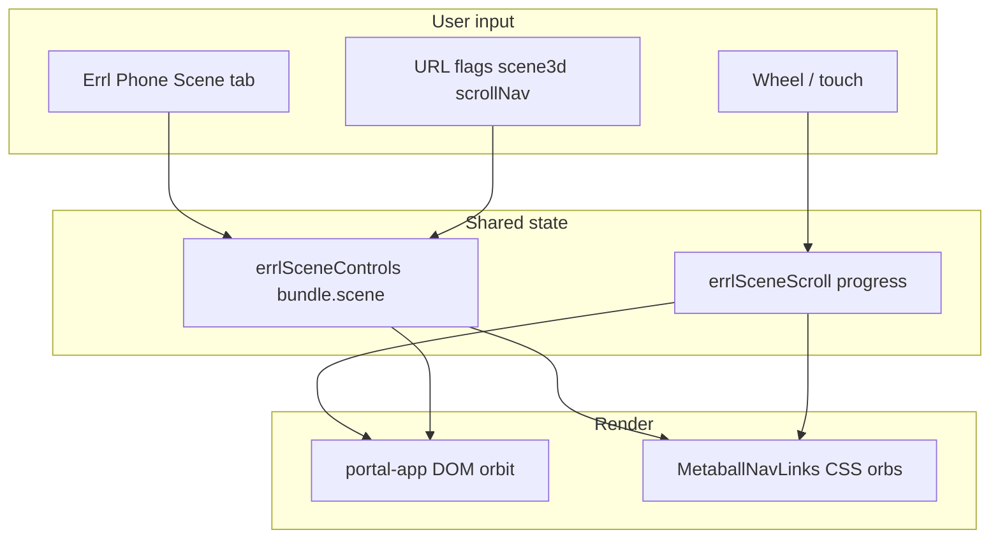

# ERRL cinematic + Scene controls — master plan & audit

**Last updated:** 2026-06-06  
**Agent handoff (scene3d nav):** `docs/scene3d-nav-agent-handoff.md`
**Purpose:** Single checklist for everything built across the cinematic redesign and Scene/Phone control work. Use this to verify behavior, finish gaps, and pick next tasks.  
**Session log:** `05-Logs/Daily/2026-05-28-cursor-notes.md`

---

## How to verify quickly

| URL / action | What you should see |
|--------------|---------------------|
| `/` | Arrival overlay + **ENTER** (first visit); **metaball nav** after enter (default) |
| `/?skipIntro=1` | Skip arrival; main scene with metaball nav |
| `/?skipIntro=1&dom=1` | Legacy DOM bubble nav |
| `/?dev=1&skipIntro=1` | Above + Errl Phone available |
| `/?dev=1&skipIntro=1&scene3d=1` | Same as default metaball (alias) |
| `/?dev=1&skipIntro=1` + scroll wheel | Nav orbit carousel around Errl (wheel bus + Lenis runway) |
| `/?scrollNav=0` | Scroll does not drive nav |
| `/fx/metaball-lab/` | Isolated metaball shader (no labels) |
| `/gallery/` | Floating hall R3F spike (manifest-driven frames) |
| `/about/` | Lenis smooth scroll (if `about-scroll.mjs` loaded on that page) |
| Long-press Errl (~2s) | Phone unlock without `?dev=1` |

**Playwright helper:** `gotoPortalLanding()` → `?dev=1&skipIntro=1`

---

## Track A — Original cinematic redesign

| Item | Status | Notes |
|------|--------|-------|
| **4-bubble nav** (Forum, About, Gallery, Studio) | Done | `src/index.html` `#navOrbit`; Assets/Design removed from orbit |
| **Score HUD removed** | Done | `#rbCollectScoreWrap` removed from HTML; `renderScoreHud()` early-returns |
| **RB default `ambient`** | Done | `errl-defaults.json`, Phone RB mode, `rise-bubbles-three.js` |
| **Errl Phone hidden by default** | Done | `dev-phone-unlock.js`, `body.errl-phone-hidden` |
| **Darker landing / slower wobble** | Done | `styles.css` |
| **React scene island** (arrival → entering → main) | Done | `src/apps/landing/scene/` |
| **ENTER + GSAP transition** | Done | `ArrivalPhase`, `TransitionPhase`; reduced-motion path |
| **`?skipIntro=1` / session `errl_entered_v1`** | Done | `App.tsx` |
| **Metaball lab** `/fx/metaball-lab/` | Done | WebGL `MetaballNavCanvas` + SDF shader |
| **Scene3d nav `?scene3d=1`** | Done | `MainPhase` → `NavSculptures` → **`MetaballNavLinks`** (DOM orbs) |
| **Quality tiers** (low/med/high, DPR cap) | Done | `scene/quality.ts` |
| **Lenis on About** | Done | `src/shared/scripts/about-scroll.mjs` |
| **ScrollDirector stub** | Done | Lenis + 300vh runway feeds `scrollBridge`; RB ambient scroll drift |
| **About lore copy** | Done | `about-content.mjs` |
| **Gallery immersive plan** | Spike | Floating hall at `/gallery/` (R3F); full rooms still planned |
| **Homepage virtual scroll + ScrollTrigger** | Partial | Lenis runway wired; GSAP chapters deferred |
| **Retire Pixi nav mirror orbs** | Partial | Hidden in metaball mode; guards + tests |
| **Bundle Three in `rise-bubbles-three.js`** | Done | Vite `import('three')` replaces CDN |
| **`Atmosphere.tsx` / `PostFX.tsx` split** | Not started | PostFX inline in `MetaballNavCanvas` |
| **Theatre.js** | Not started | — |

---

## Track B — Scene + Phone controls (phased plan)

| Phase | Status | Deliverables |
|-------|--------|----------------|
| **1** Nav render mode | Done | `navRenderMode.ts`, body classes, Nav tab notice, `bundle.scene`, 4 skin targets |
| **2** Control bus + shader | Done | `sceneControls.ts`, `errlSceneControls`, `metaballSDF` uniforms, `MetaballNavCanvas` |
| **3** Scene tab | Done | `data-tab="scene"`, `scene-phone-controls.ts` |
| **4** Presets | Done | Portal / Metaball / Atmospheric in `scene-presets.ts` |
| **5** URLs + persistence | Done | `buildSceneQuery()`, `?scenePreset=` boot hydration, Copy scene link in Scene tab |

### Scene bundle shape (`bundle.scene`)

```json
{
  "navRenderMode": "metaball" | "dom",
  "preset": "portal" | "metaball" | "atmospheric",
  "metaball": { "steps", "bloomIntensity", "bloomThreshold", "vignetteDarkness", "glow", "mergeK", "pointerPull" },
  "sculpture": { "magneticRadius", "separation", "floatSpeed", "scrollInfluence" }
}
```

**Source of truth:** `localStorage` key `errl_portal_settings_v1` → `bundle.scene`  
**Runtime API:** `window.errlSceneControls`  
**Events:** `errl:scene-controls-changed` (same event used for nav mode UI)

---

## Cross-cutting — Scroll → nav bubbles

| Item | Status | Notes |
|------|--------|-------|
| Wheel / touch → orbit offset | Done | `scrollBridge.ts`, `window.errlSceneScroll` |
| DOM bubbles read scroll | Done | `portal-app.js` `updateBubbles` / `placeBubble` |
| Metaball labels read scroll | Done | `useNavPhysics.ts` |
| Scene tab **Scroll pull** | Done | `sceneSculptureScroll` |
| `?scrollNav=0` | Done | Disables driver |
| `prefers-reduced-motion` | Done | Driver does not accumulate |
| Lenis runway on homepage | Not started | Future: feed same bus from `ScrollDirector` |

---

## File map (implementation)

```
src/apps/landing/scene/
  App.tsx, main.tsx
  navRenderMode.ts, sceneTypes.ts, quality.ts
  phases/          ArrivalPhase, TransitionPhase, MainPhase
  nav/             navConfig, NavSculptures, MetaballNavLinks, useNavPhysics, orbitLayout
  effects/         MetaballNavCanvas.tsx (lab), shaders/metaballSDF.ts
  bridge/          sceneControls.ts, scene-presets.ts, scene-controls-init.ts, legacyBridge.ts
  scroll/          scrollBridge.ts, ScrollNavDrive.tsx, ScrollDirector.ts

src/apps/landing/scripts/
  portal-app.js           — DOM orbit, bundle normalize, score stub
  dev-phone-unlock.js     — ?dev=1 + long-press
  nav-render-mode-phone.ts
  scene-phone-controls.ts

src/apps/static/pages/fx/metaball-lab/main.tsx

docs/
  scene3d-nav-agent-handoff.md     ★ Agent handoff for metaball nav work
  cinematic-scene-master-plan.md   (this file)
  gallery-immersive-architecture.md
  reference/errl-phone-capabilities.md

tests/scene-phone-controls.spec.ts   — 6 tests, passing
```

---

## Test & CI status

| Suite | Status | Notes |
|-------|--------|-------|
| `tests/scene-phone-controls.spec.ts` | **7/7 pass** | Nav mode, Scene tab, presets, scroll bus, URL hydration |
| `tests/home-page-verification.test.ts` (nav/RB subset) | Updated | Uses `gotoPortalLanding()` + Scene tab |
| `tests/errl-phone-controls.spec.ts` | Mixed | RB **score** tests intentionally `test.skip` |
| Full repo Playwright | Not run in last audit | Run before production deploy |

### Recommended test fixes (not done yet)

- [ ] Update `home-page-verification.test.ts` `beforeEach` to use `gotoPortalLanding()` or `?dev=1` where phone is required
- [ ] Add visual/smoke test for arrival → ENTER flow (optional)
- [ ] Add `?scenePreset=atmospheric` hydration test when Phase 5 URL load exists

---

## Manual QA checklist

Use this before calling the work “done” on main.

### Landing — DOM nav

- [ ] Arrival shows; ENTER runs transition; bubbles appear
- [ ] Four bubbles only; links work (Forum external, About/Gallery/Studio internal)
- [ ] Phone hidden without dev; long-press Errl opens phone
- [ ] Nav tab: orbit, radius, size, skins apply
- [ ] Scroll after main phase moves bubbles
- [ ] Scene tab: sliders change feel; presets apply (confirm dialog)
- [ ] Panel **Back** undoes preset after apply

### Landing — Metaball

- [ ] `?scene3d=1` shows **four colored CSS orbs** with labels centered on balls, orbiting Errl
- [ ] No visible `#riseBubbles` or Pixi GL nav orbs in metaball mode
- [ ] Nav tab shows metaball notice; DOM controls disabled
- [ ] Scene **sculpture** sliders affect orbit feel; metaball shader sliders affect lab only
- [ ] Metaball preset reloads with `scene3d=1`

### Lab & About

- [ ] `/fx/metaball-lab/` renders; sliders via same bus if phone/lab wired
- [ ] `/about/` scrolls smoothly

### Regression

- [ ] Rising Bubbles ambient motion; no score HUD on screen
- [ ] Static pages (Gallery, Studio) headers show 4 destinations only
- [ ] `saveDefaults` / reload does not break phone panel size (see `.cursor/plans/errl-phone-panel-ux.md`)

---

## Known gaps & risks

1. **No feature branch** — work is on current branch; document + test before merge to main.
2. **Phone-gated tests** — many specs assume phone reachable without `?dev=1`.
3. **Score engine dead code** — reducer still in `portal-app.js`; HUD removed but not deleted.
4. **Classic RB modes** — still in engine/phone; only default is ambient; classic goals UI removed.
5. **Metaball + DOM** — switching modes requires reload; expected.
6. **`buildSceneQuery` / `scenePreset` URL** — query built but not applied on page load.
7. **Large JS chunk** — `MetaballNavCanvas` ~1.1MB minified; consider lazy load when `scene3d=1`.
8. **Pixi GL orbs** — guarded when metaball active; DOM-first nav does not use them.
9. **Gallery immersive** — architecture doc only.

---

## What to do next (prioritized)

### P0 — Stabilize & document (you are here)

- [x] Master plan (this doc)
- [x] Fix `home-page-verification` dev-phone assumptions
- [x] Deploy to errl.wtf (`1f8ce18`)
- [ ] Run full `npx playwright test` once; file failures in this doc or 05-Logs

### P1 — Finish Scene phase 5

- [x] On boot: read `?scenePreset=` and apply via `applyScenePreset`
- [x] “Copy scene link” button in Scene tab (`buildSceneQuery()` + clipboard)
- [ ] `portal-app` `setBundle` / load: sync Scene tab sliders from `bundle.scene`

### P2 — Cinematic scroll (deeper)

- [ ] Hidden scroll runway (`300vh`) + Lenis driving `scrollBridge` progress (real page scroll feel)
- [ ] Optional: GSAP ScrollTrigger chapters (About-style) on landing
- [ ] Tie scroll progress to RB drift (subtle)

### P3 — Production polish

- [ ] Lazy-load Three/R3F only when `scene3d=1` or metaball preset
- [ ] Retire or hide Pixi nav mirror when metaball active
- [ ] CDN → bundled Three in `rise-bubbles-three.js`
- [ ] Gallery room prototype per `gallery-immersive-architecture.md`

### P4 — Nice to have

- [ ] Theatre.js timeline for arrival/enter
- [ ] Split `Atmosphere.tsx` / `PostFX.tsx`
- [ ] Remove dead score reducer code paths

---

## Documentation index

| Doc | Role |
|-----|------|
| `docs/cinematic-scene-master-plan.md` | This audit + roadmap |
| `05-Logs/Daily/2026-05-28-cursor-notes.md` | Session changelog |
| `docs/reference/errl-phone-capabilities.md` | Phone tabs, Scene tab, scroll nav |
| `docs/gallery-immersive-architecture.md` | Future gallery work |
| `.cursor/plans/errl-phone-panel-ux.md` | Phone stuck-small bug + UX (parallel) |

---

## Architecture (current)



> **2026-06-06:** Landing metaball nav uses `MetaballNavLinks`, not R3F `MetaballNavCanvas`. See `docs/scene3d-nav-agent-handoff.md`.

---

## Changelog pointer

For line-by-line session history, see agent transcript `020cdc38-1f7c-41be-895b-74c9361a5386` and `05-Logs/Daily/2026-05-28-cursor-notes.md`. Update this master plan when completing items from **What to do next**.
