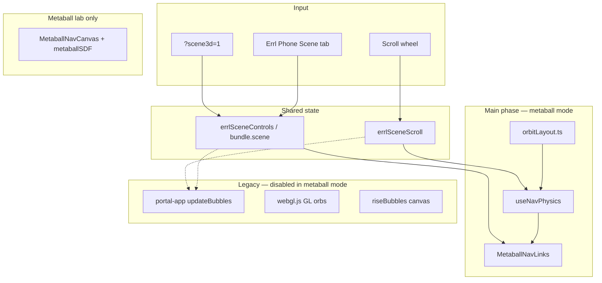

# Scene3d / Metaball Nav — Agent Handoff

**Last updated:** 2026-06-06  
**Status:** Landing metaball nav **works** (DOM-first). WebGL SDF nav on landing **retired**; lab only.  
**Session logs:** `05-Logs/Daily/2026-06-06-cursor-notes.md`, `05-Logs/Daily/2026-05-28-cursor-notes.md`  
**Related:** `docs/cinematic-scene-master-plan.md`, `docs/reference/errl-phone-capabilities.md`

---

## 1. What we are building (vision)

A **cinematic Errl Portal landing** with two nav render modes:

| Mode | Trigger | Experience |
|------|---------|------------|
| **DOM nav** (legacy) | `?dom=1`, Scene preset “Portal”, or saved `bundle.scene.navRenderMode: "dom"` | Four iridescent `menuOrb` bubbles orbit Errl via `portal-app.js`; Pixi GL orbs can mirror them |
| **Metaball / scene3d nav** (default) | Normal landing, `?scene3d=1`, Scene preset “Metaball”, or `bundle.scene.navRenderMode: "metaball"` | Four **colored glowing orbs** orbit Errl with **labels centered on the balls**; legacy DOM bubbles hidden |

Both modes share:

- Same **4 destinations**: Forum (external), About, Gallery, Studio — see `navConfig.ts`
- Same **orbit math** (Errl center, `data-angle` / `data-dist` parity in pixels)
- Same **scroll → orbit** bus (`window.errlSceneScroll`) after main phase
- **Intro flow preserved**: Arrival → ENTER → Main (or `?skipIntro=1`)

Subpages (About, Gallery, Studio) use static layouts; Gallery has a **floating hall R3F spike** at `/gallery/`; remaining rooms are **future work** (`docs/gallery-immersive-architecture.md`).

---

## 2. Current architecture (2026-06-06)

### Scene React island

```
src/apps/landing/scene/
  App.tsx              — phases: arrival | entering | main
  main.tsx             — mounts into #errl-scene-root
  phases/
    ArrivalPhase.tsx   — ENTER overlay
    TransitionPhase.tsx — GSAP handoff
    MainPhase.tsx      — renders NavSculptures when metaball mode active
  nav/
    NavSculptures.tsx  — applies metaball body classes; renders MetaballNavLinks
    MetaballNavLinks.tsx  ★ LANDING NAV (DOM orb + label per link)
    navConfig.ts       — angles, dists, colors, hrefs
    orbitLayout.ts     — pixel orbit math shared with DOM
    useNavPhysics.ts   — spring physics in CSS px around Errl
  effects/
    MetaballNavCanvas.tsx  — WebGL SDF shader (metaball lab ONLY)
    shaders/metaballSDF.ts
  navRenderMode.ts   — dom vs metaball; body classes; hide Pixi orbs
  bridge/
    sceneControls.ts — bundle.scene, errlSceneControls API
    scene-controls-init.ts — sync nav mode on load before portal-app.js
  scroll/
    scrollBridge.ts  — wheel/touch → errlSceneScroll
    ScrollNavDrive.tsx — mounts scroll driver in main phase
```

### Landing metaball nav (ground-up DOM design)

**Do not reintroduce a separate WebGL canvas + floating text labels on the landing page.** That approach failed (see §5).

Each nav item is one anchor:

```html
<a class="errl-metaball-link errl-scene-3d-label" style="--nav-ball-color; --nav-ball-diam">
  <span class="errl-metaball-link__orb" />
  <span class="label">Forum</span>
</a>
```

- **Physics:** `useNavPhysics` + `requestAnimationFrame` in `MetaballNavLinks.tsx`
- **Position:** `left` / `top` in CSS px, `transform: translate(-50%, -50%)`
- **Style:** `arrival.css` — radial gradient orb + glow per `--nav-ball-color`

### Legacy layers (must stay isolated in metaball mode)

| Layer | File | Metaball behavior |
|-------|------|-------------------|
| DOM orbit loop | `portal-app.js` `updateBubbles()` | Early return when `errl-nav-mode-metaball` |
| DOM bubbles | `#navOrbit`, `#navOrbitBehind` | `visibility: hidden` |
| Pixi GL orbs | `webgl.js` | `errlGLShowOrbs(false)`; sync/build guarded |
| Rising bubbles | `#riseBubbles` | Hidden (`opacity: 0; visibility: hidden`) |
| GL orbs toggle | `portal-app.js` | Ignored in metaball mode |

### Metaball lab (shader playground)

- URL: `/fx/metaball-lab/`
- Uses `MetaballNavCanvas.tsx` (R3F + `metaballSDF.ts` ScreenQuad)
- No nav labels; for tuning glow/merge/shader only

---

## 3. How to run and test

### Dev server

```bash
npm run portal:dev -- --host 127.0.0.1 --port 5173 --strictPort
```

### Key URLs

| URL | Purpose |
|-----|---------|
| `http://127.0.0.1:5173/?skipIntro=1` | DOM nav, no intro |
| `http://127.0.0.1:5173/?dev=1&skipIntro=1&scene3d=1` | **Metaball nav** + Errl Phone |
| `http://127.0.0.1:5173/fx/metaball-lab/` | Shader lab |
| `http://127.0.0.1:5173/?scrollNav=0` | Disable scroll-driven orbit |

### Tests (local-first)

```bash
PLAYWRIGHT_BASE_URL=http://127.0.0.1:5173 npm run test:local:audit   # 12 tests
npm run test:local                                                  # audit + visual + build-output
npm run build
node --check src/apps/landing/scripts/portal-app.js
```

**Scene3d assertion:** `.errl-scene-3d-label .label` count ≥ 4, text Forum/About/Gallery/Studio.

**Helper:** `gotoPortalLanding()` in tests → `?dev=1&skipIntro=1`.

---

## 4. Orbit math (DOM ↔ metaball parity)

Shared module: `src/apps/landing/scene/nav/orbitLayout.ts`

- `getErrlCenterPx()` — `#errl` bounding rect + scroll `centerOffsetY`
- `getOrbitDistPx(baseDist)` — same tier/viewport scale as DOM `placeBubble`
- `getScene3dBubbleRadiusPx()` — bubble size for clamping
- `isErrlLayoutReady()` — gate until Errl has measurable layout (avoids corner snap)

Physics targets: `useNavPhysics.ts` → `orbitTargetPx()` uses angles/dists from `navConfig.ts` (mirrors `#navOrbit .bubble` `data-angle` / `data-dist`).

---

## 5. What failed (do not repeat)

### WebGL SDF nav on landing (MetaballNavCanvas + label overlay)

Attempted: R3F Canvas with screen-space SDF shader + separate DOM labels driven by same physics.

**Symptoms:**

- Labels orbited Errl; shader balls invisible or misaligned
- `#riseBubbles` (3D rising bubbles) looked like nav orbs — user confusion
- HMR stacked multiple WebGL canvases (5+ under `.errl-scene-3d-nav`)
- `EffectComposer` stalled `useFrame` on desktop → labels fell back to viewport center
- `readPixels` at label coords = transparent on nav canvas

**Resolution:** `MetaballNavLinks.tsx` — single DOM element per link (orb + label). Shader kept for lab only.

### Other fixed bugs

- `portal-app.js` ~647: broken `getActiveBubbles()` (Vite HMR syntax error) — fixed
- DOM `updateBubbles` fighting scene3d physics — early return in metaball mode
- Pixi GL orbs showing through — guarded in `webgl.js` + `navRenderMode.ts`

---

## 6. Scene / Phone controls

- **Storage:** `localStorage` `errl_portal_settings_v1` → `bundle.scene`
- **API:** `window.errlSceneControls` (`sceneControls.ts`)
- **Event:** `errl:scene-controls-changed`
- **Scene tab:** `scene-phone-controls.ts` — metaball + sculpture sliders, presets
- **Presets:** `scene-presets.ts` — portal / metaball / atmospheric
- **Nav tab:** DOM controls disabled when metaball notice shown (`nav-render-mode-phone.ts`)

Sculpture sliders affect metaball **physics** (separation, magnetic, float, scroll pull). Metaball sliders (glow, mergeK) affect **lab shader** only unless re-wired to CSS orbs.

---

## 7. Body classes (metaball mode)

Applied by `applyNavRenderModeToDocument()` in `navRenderMode.ts`:

- `errl-nav-mode-metaball`
- `errl-scene-3d-nav`

CSS: `src/apps/landing/styles/arrival.css`

---

## 8. File change map (this effort)

| File | Role |
|------|------|
| `scene/nav/MetaballNavLinks.tsx` | **Primary landing nav** |
| `scene/nav/NavSculptures.tsx` | Mounts MetaballNavLinks |
| `scene/nav/useNavPhysics.ts` | Orbit springs, snap on reanchor |
| `scene/nav/orbitLayout.ts` | Pixel orbit helpers |
| `scene/effects/MetaballNavCanvas.tsx` | Lab shader only |
| `scene/bridge/scene-controls-init.ts` | Early nav mode apply |
| `scripts/portal-app.js` | DOM orbit + metaball guards |
| `scripts/webgl.js` | Pixi orb guards |
| `styles/arrival.css` | Metaball link orbs + hide legacy |

---

## 9. Done vs not done

### Done ✓

- [x] DOM nav orbit parity (mobile/desktop tiers, min dist from Errl)
- [x] Metaball nav: colored orbs + labels on same element, orbiting Errl
- [x] Legacy isolation (DOM loop, GL orbs, riseBubbles, hidden DOM bubbles)
- [x] Scene island (arrival / enter / main)
- [x] Scroll → nav bus (DOM + metaball)
- [x] Scene tab + presets + `?scene3d=1` persistence
- [x] Metaball lab route
- [x] Local-first Playwright audit (12/12)
- [x] Subpage viewport-fill layouts (About, Gallery, Studio)

### Not done / future

- [ ] **Lazy-load** Three/R3F only for metaball lab (reduce main chunk if lab code bleeds into landing bundle)
- [ ] Wire Scene tab **metaball sliders** to CSS orb appearance (glow, merge visual) on landing
- [ ] **Homepage Lenis runway** + ScrollTrigger chapters (`ScrollDirector.ts` stub exists)
- [ ] **Gallery immersive** 3D room (`docs/gallery-immersive-architecture.md`)
- [ ] Retire dead **score HUD** reducer code in `portal-app.js`
- [ ] Bundle **Three** in `rise-bubbles-three.js` (still CDN)
- [ ] Visual regression snapshot update for new DOM metaball look
- [ ] Deploy + prod audit after merge
- [ ] Optional: merge SDF goo between CSS orbs (SVG filter or canvas) for “metaball merge” aesthetic on landing

---

## 10. Agent quick-start checklist

When picking up this work:

1. Start dev server; open `/?dev=1&skipIntro=1&scene3d=1`
2. Confirm **4 colored orbs** with centered labels orbit Errl (not text-only, not bottom-corner blobs)
3. Confirm `#riseBubbles` not visible; no duplicate Pixi orbs
4. Run `npm run test:local:audit`
5. Read `MetaballNavLinks.tsx` before touching nav rendering
6. **Do not** put WebGL nav canvas back on landing without solving shader visibility + single-canvas lifecycle
7. Match orbit changes in **both** `portal-app.js` (DOM) and `orbitLayout.ts` / `useNavPhysics.ts` (metaball)

---

## 11. Architecture diagram (current)



---

## 12. Git / deploy note

Work described here was **local WIP** as of 2026-06-06 — verify `git status` before assuming production parity. Prior deploy references in older docs may predate DOM-first metaball nav.

---

## 13. Documentation index

| Document | Use |
|----------|-----|
| **This file** | Agent handoff for scene3d / metaball nav |
| `docs/cinematic-scene-master-plan.md` | Broader cinematic + Scene controls roadmap |
| `docs/reference/errl-phone-capabilities.md` | Phone tabs API |
| `docs/gallery-immersive-architecture.md` | Future gallery |
| `.cursor/plans/scene3d-nav-handoff.md` | Short pointer for Cursor agents |
| `05-Logs/Daily/2026-06-06-cursor-notes.md` | Latest session changelog |
