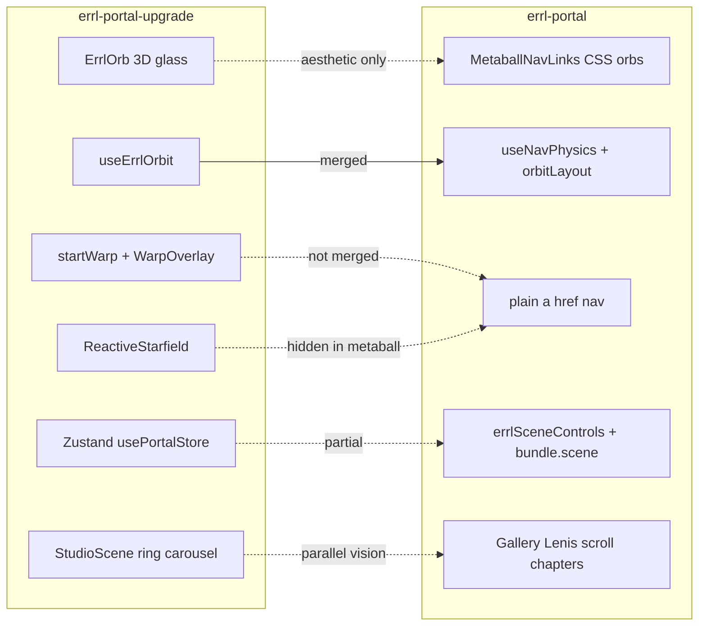

# Errl Portal Upgrade — Merge Handoff

**Last updated:** 2026-06-06  
**Audience:** Cursor agents, future sessions  
**Purpose:** Map `errl-portal-upgrade` (sibling repo) to current `errl-portal` work. Explains what metaball nav already merges, what is still open, and what not to port.

**Sibling repo path:** `/Users/extrepa/Projects/errl-portal-upgrade`  
**Related docs:** `docs/scene3d-nav-agent-handoff.md`, `docs/cinematic-scene-master-plan.md`, `docs/gallery-immersive-architecture.md`, `docs/runtime-global-api.md`

---

## 1. Executive summary

**Metaball nav is the merge layer.** The upgrade repo's Phase B lobby (`ErrlOrb` glass bubbles in R3F) was reinterpreted in the current repo as **DOM-first metaball nav** (`MetaballNavLinks.tsx`). Same vision — orbiting destination bubbles around Errl — different stack constraints.

| Repo | Stack | Nav approach |
|------|-------|--------------|
| `errl-portal-upgrade` | Next.js App Router, R3F v8 (blocked on React 19), Zustand | 3D `ErrlOrb` + `MeshTransmissionMaterial` + warp overlay |
| `errl-portal` (this repo) | Vite multi-app, R3F v9 + React 19, legacy `portal-app.js` | CSS glowing orbs + shared pixel orbit physics |

**Do not treat upgrade as a merge source for dependencies or folder structure.** Port **ideas and patterns** only.

---

## 2. Conceptual merge map



---

## 3. Upgrade repo — where to look

### Canonical planning (read first)

| Path | Contents |
|------|----------|
| `upgrade/Errl_Portal_Upgrade_Pack/MASTER_PORTAL_UPGRADE_PLAN.md` | North star: lobby, warp, ErrlPhone, pocket dimensions |
| `upgrade/Errl_Portal_Upgrade_Pack/CURSOR_TASKLIST.md` | Phase A–F checkbox build order |
| `upgrade/Errl_Portal_Upgrade_Pack/LOOK_AND_FEEL_NOTES.md` | Motion/material language (glass, breathing, warp timing) |
| `upgrade/Errl_Portal_Upgrade_Pack/RISKS_AND_FIXES.md` | Hydration, perf, gestures, single warp controller |
| `docs/effects-master-reference.md` | ~1900-line effects + phone panel reference |

### Runnable prototype (patterns to borrow)

| Path | Borrow for |
|------|------------|
| `errl-portal-nextjs/components/canvas/ErrlOrb.tsx` | Click scale, hover, `startWarp` on click |
| `errl-portal-nextjs/hooks/useErrlOrbit.ts` | Breathing orbit math (already mirrored in `useNavPhysics`) |
| `errl-portal-nextjs/components/dom/WarpOverlay.tsx` | Framer Motion glitch curtain |
| `errl-portal-nextjs/components/logic/WarpNavigation.tsx` | Navigate at overlay peak timing |
| `errl-portal-nextjs/store/usePortalStore.ts` | State shape: `warp`, `ui`, `errlDNA`, `focus`, `perf` |
| `errl-portal-nextjs/components/canvas/StudioScene.tsx` | Ring carousel + ESC to clear focus |
| `errl-portal-nextjs/components/canvas/ArtFrame.tsx` | Hover scale, click-to-focus |
| `errl-portal-nextjs/components/canvas/CameraRig.tsx` | Focus lerp + warp camera accel |
| `errl-portal-nextjs/components/canvas/ReactiveStarfield.tsx` | Instanced starfield backdrop |
| `errl-portal-nextjs/components/canvas/LobbyScene.tsx` | How orbs + starfield + camera compose |

### Do not copy from upgrade

- `package.json` R3F v8 (`^8.18.0`) — blocked on React 19; see `REACT_19_R3F_STATUS.md`
- Next.js App Router / `app/` layout — current repo is Vite static + scene island
- `routeMapper.ts` mapping `/gallery/` → `/studio` — gallery is its own page here
- WebGL nav canvas on landing — failed here too; see §6

---

## 4. Current repo — merge status by feature

### Merged ✓

| Upgrade concept | Current implementation | Key files |
|-----------------|------------------------|-----------|
| Glass/glowing bubble nav | CSS radial-gradient orbs + per-destination color | `MetaballNavLinks.tsx`, `arrival.css` |
| Breathing orbit | Wobble on angle/radius + scroll influence | `useNavPhysics.ts`, `orbitLayout.ts` |
| 4 destinations orbiting Errl | Forum, About, Gallery, Studio | `navConfig.ts` |
| DOM ↔ metaball orbit parity | Shared pixel math + Playwright test | `dom-metaball-parity.spec.ts` |
| Scene DNA / sliders | `bundle.scene`, presets, Scene tab | `sceneControls.ts`, `scene-presets.ts` |
| Scroll-driven lobby | Lenis runway + chapters approach/orbit/departure | `scrollChapters.ts`, `ScrollNavDrive.tsx` |
| Metaball SDF shader (tuning) | Lab route only | `/fx/metaball-lab/`, `metaballSDF.ts` |
| Gallery immersive spike | Floating hall + CRT / vitrine / pin shelf | `src/apps/gallery/`, `gallery/main.tsx` |
| R3F + React 19 | `@react-three/fiber@^9.6.1` | `FloatingHall.tsx` |

### Partially merged ~

| Upgrade concept | Current state | Gap |
|-----------------|---------------|-----|
| Metaball merge aesthetic (`smin`) | CSS `--nav-orb-merge` approx; shader in lab | Scene tab sliders don't fully drive landing orb look |
| Global store | `errlSceneControls` + `errl_portal_settings_v1` | No `focus` or `warp` slices yet |
| ErrlPhone HUD | Legacy `portal-app.js` panel | Not React/Zustand; see `.cursor/plans/errl-phone-panel-ux.md` |
| Gallery museum | Scroll chapters through rooms | No click-to-focus camera lerp |

### Not merged ✗

| Upgrade concept | Why it matters | Upgrade reference |
|-----------------|----------------|-------------------|
| Warp navigation | **Done (P1)** | DOM overlay on internal metaball clicks; Forum stays external | `warpNav.ts`, `WarpOverlay.tsx`, `MetaballNavLinks.tsx` |
| ReactiveStarfield backdrop | Deep-space lobby atmosphere | `ReactiveStarfield.tsx`, `LobbyScene.tsx` |
| Ring carousel + focus zoom | Click frame → camera lerp | `StudioScene.tsx`, `ArtFrame.tsx`, `CameraRig.tsx` |
| Assets toybox / Chat / Forum worlds | Pocket dimensions E.2+ | `ToyboxWorld.tsx`, etc. |

---

## 5. Metaball = merge layer (detail)

Upgrade **ErrlOrb** and current **MetaballNavLinks** are the same product decision:

| Aspect | Upgrade `ErrlOrb` | Current `MetaballNavLinks` |
|--------|-------------------|---------------------------|
| Material | `MeshTransmissionMaterial` (3D glass) | CSS `radial-gradient` + `box-shadow` glow |
| Orbit | `useErrlOrbit` (XZ plane, breathing radius) | `useNavPhysics` → `orbitTargetPx` (CSS px, wobble) |
| Labels | R3F `Text` above sphere | `<span class="label">` centered on same `<a>` |
| Click | `startWarp(route)` | `startWarpNav(href)` — 400ms glitch curtain, then navigate |
| Colors | Per-orb material | `--nav-ball-color` from `navConfig.ts` |
| Merge/goo | Implicit in transmission | `--nav-orb-glow`, `--nav-orb-merge` CSS vars |

**Why DOM-first won:** WebGL SDF nav on landing failed (labels misaligned, multiple canvases under HMR, EffectComposer stalled `useFrame`, riseBubbles confused with nav). Documented in `docs/scene3d-nav-agent-handoff.md` §5. Shader kept for lab only.

---

## 6. Destination map (routes differ)

| Label | Current `navConfig.ts` | Upgrade `LobbyScene.tsx` |
|-------|------------------------|--------------------------|
| Forum | `https://forum.errl.wtf` (external) | `/forum` |
| About | `/about/` | — (not in upgrade lobby) |
| Gallery | `/gallery/` | — (upgrade maps gallery → studio) |
| Studio | `/studio/` | `/studio` |
| Assets | — | `/assets` |
| Chat | — | `/chat` |

When porting warp or lobby ideas, use **current** `NAV_ITEMS` — do not drop About/Gallery for upgrade's Assets/Chat without an explicit product decision.

---

## 7. Recommended merge order (for agents)

### P1 — Warp on internal nav click ✓ (2026-06-06)

**Shipped:** `warpNav.ts`, `WarpOverlay.tsx`, click intercept on `MetaballNavLinks` (About/Gallery/Studio). Forum external unchanged. Tests: `tests/warp-nav.spec.ts`.

### P2 — Wire Scene tab metaball sliders to landing orbs

**Goal:** Scene tab glow/merge sliders visibly change CSS orbs (upgrade control-loop parity).

**Status:** `MetaballNavLinks` already sets `--nav-orb-glow` / `--nav-orb-merge` from `getMetaball()`; confirm all sliders map and document in Scene tab copy.

**Files:** `MetaballNavLinks.tsx`, `arrival.css`, `scene-phone-controls.ts`

### P3 — Optional SDF goo between CSS orbs

**Goal:** True metaball merge on landing without full-screen WebGL nav canvas.

**Options:** SVG filter, small overlay canvas sampling `metaballSDF.ts` logic, or CSS-only (current approx).

**Risk:** Performance on mobile; tier-gate via `quality.ts`.

### P4 — Gallery focus mode (keep scroll chapters)

**Goal:** Upgrade `StudioScene` click-to-focus without replacing Lenis room journey.

**Port from:** `ArtFrame.tsx` hover/click, `CameraRig.tsx` focus lerp, `usePortalStore` `focus` slice (or `bundle.scene.focus`).

**Keep:** `gallery/main.tsx` chapters hall → CRT → vitrine → shelf.

**Files:** `FloatingHall.tsx`, new focus state in scene bridge or gallery-local state.

### P5 — Decorative starfield (not nav)

**Goal:** Upgrade `ReactiveStarfield` atmosphere without riseBubbles/nav confusion.

**Constraint:** Must not look like a 5th nav orb. Tier-gate; hidden on `prefers-reduced-motion`.

### P6 — Extend `bundle.scene` (additive only)

**Do not replace** `portal-app.js` / `errl_portal_settings_v1`. Add slices:

```ts
// additive — mirror upgrade usePortalStore groups
focus?: { artId: string | null; target?: { x: number; y: number; z: number } }
warp?: { stage: 'IDLE' | 'OUT' | 'IN'; targetRoute: string | null }
```

Expose via `errlSceneControls` if cross-page; see `docs/runtime-global-api.md`.

---

## 8. What NOT to port

| From upgrade | Reason |
|--------------|--------|
| Next.js App Router | Current Vite multi-app works; static pages + scene island |
| R3F v8 | Current repo on R3F v9 + React 19; upgrade blocked |
| WebGL nav canvas on landing | Failed; lab only — `docs/scene3d-nav-agent-handoff.md` §5 |
| Full Zustand replacing `portal-app.js` | Too disruptive; extend `bundle.scene` instead |
| Upgrade route map (`/gallery/` → `/studio`) | Gallery is first-class here |
| Duplicate ErrlPhone React component | Fix legacy panel first (`.cursor/plans/errl-phone-panel-ux.md`) |

---

## 9. Architecture comparison

### Upgrade (target vision)

```
Zustand store (warp / ui / errlDNA / focus / perf)
  ├── Canvas: ErrlOrb, ReactiveStarfield, CameraRig
  ├── DOM: ErrlPhone, WarpOverlay
  └── WarpNavigation → Next.js router.push
```

### Current (shipped)

```
errl_portal_settings_v1 → bundle.scene
  ├── errlSceneControls (scene tab, presets, nav mode)
  ├── errlSceneScroll (wheel/Lenis → orbit offset)
  ├── portal-app.js (DOM nav, phone panel — legacy)
  └── Scene island: MetaballNavLinks (metaball) | DOM bubbles (dom mode)
```

**Bridge strategy:** Treat upgrade `usePortalStore` as a **spec** for new `bundle.scene` slices and scene-island components — not a replacement runtime.

---

## 10. Agent quick-start

1. Read this file + `docs/scene3d-nav-agent-handoff.md` §5 (failures to avoid)
2. Open sibling repo: `/Users/extrepa/Projects/errl-portal-upgrade/upgrade/Errl_Portal_Upgrade_Pack/MASTER_PORTAL_UPGRADE_PLAN.md`
3. Test current metaball nav: `http://127.0.0.1:5173/?dev=1&skipIntro=1`
4. Test gallery: `http://127.0.0.1:5173/gallery/`
5. Test metaball lab: `http://127.0.0.1:5173/fx/metaball-lab/`
6. Run tier A: `npm run test:tier-a`
7. For warp work: read upgrade `WarpOverlay.tsx` + `ErrlOrb` click handler before editing `MetaballNavLinks.tsx`

### Orbit change checklist (both repos' parity)

When changing nav geometry:

1. `navConfig.ts` angles/dists
2. `portal-app.js` `placeBubble` / `#navOrbit` data attributes
3. `orbitLayout.ts` helpers
4. `npm run test:tier-a` (includes `dom-metaball-parity.spec.ts`)

---

## 11. Documentation index

| Document | Role |
|----------|------|
| **This file** | Upgrade ↔ current merge map + agent tasks |
| `docs/scene3d-nav-agent-handoff.md` | Metaball nav implementation + failures |
| `docs/cinematic-scene-master-plan.md` | Cinematic + Scene controls audit |
| `docs/gallery-immersive-architecture.md` | Gallery rooms + scroll chapters |
| `docs/runtime-global-api.md` | `errlSceneControls`, `errlSceneScroll` |
| `.cursor/plans/scene3d-nav-handoff.md` | Short Cursor pointer |
| `.cursor/plans/upgrade-merge-handoff.md` | Short Cursor pointer (this doc) |
| `.cursor/plans/errl-phone-panel-ux.md` | Phone stuck-small bug + UX |
| `05-Logs/Daily/2026-06-06-cursor-notes.md` | Session changelog |

---

## 12. Changelog

| Date | Change |
|------|--------|
| 2026-06-06 | Initial merge research handoff from upgrade repo analysis |
